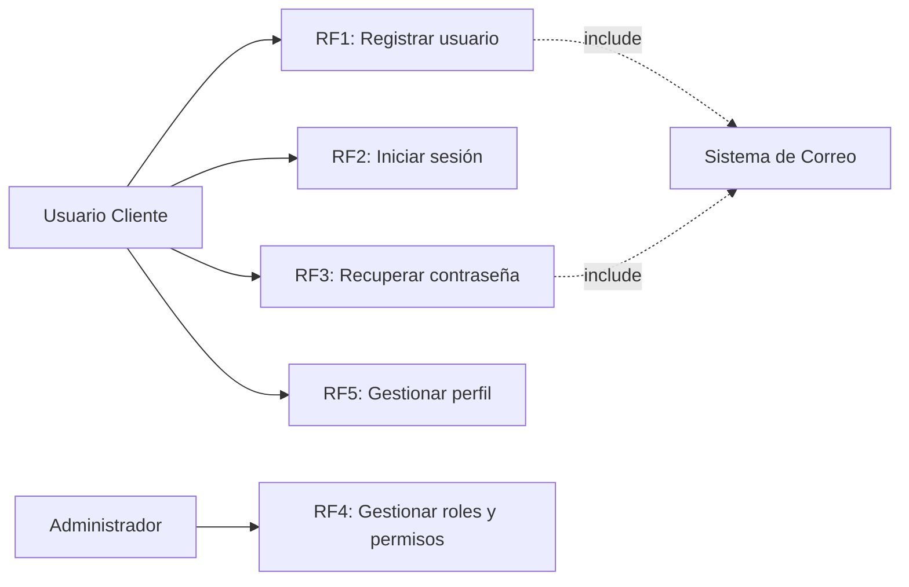
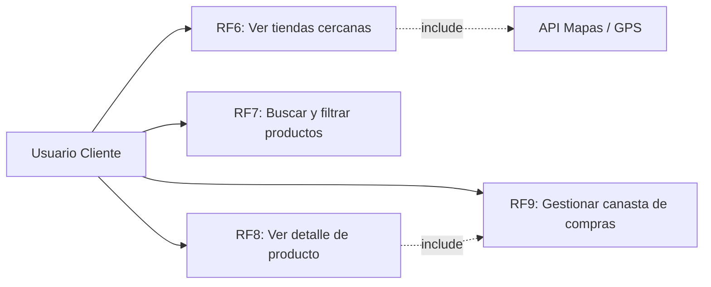
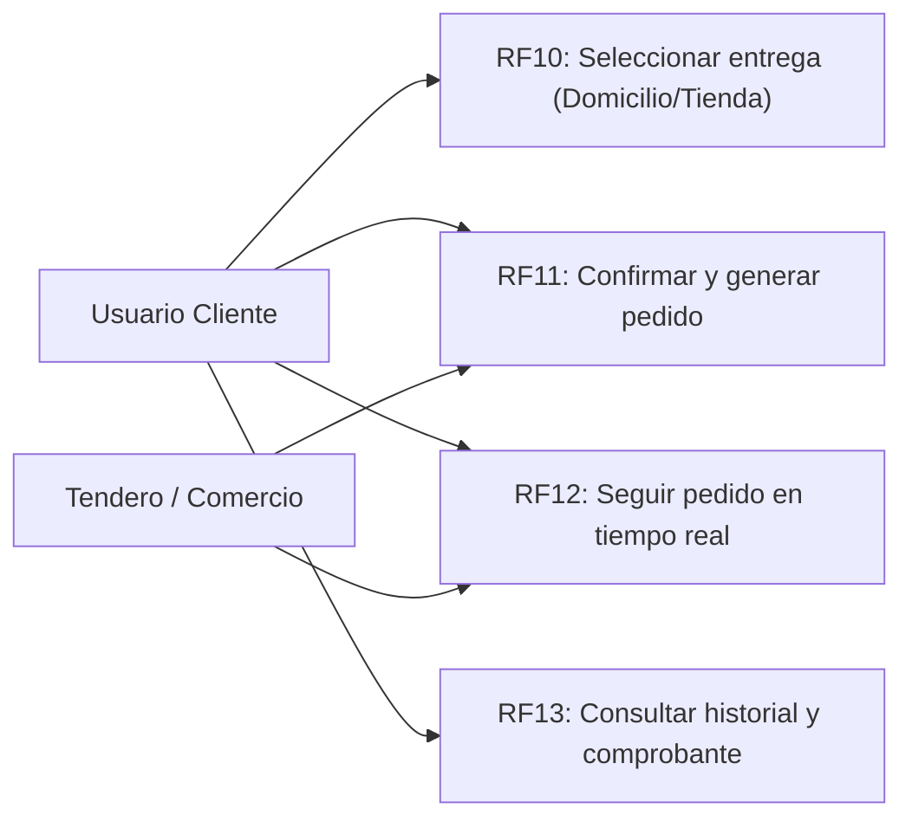

# ESPECIFICACIÓN DE REQUISITOS DE SOFTWARE (SRS)

## PROYECTO: MercaGo
**Aplicativo Multiplataforma Web y Móvil de Promociones y Gestión de Compras Familiares**

---

### INTEGRANTES:
* **Edwin Alejandro Esquivel Bahamon**
* **Jose Esneider Covaleda Hortua**
* **Paula Sofia Claros Nañez**
* **Joseph Felipe Aguirre Churta**

### INSTRUCTOR:
* **Juan Carlos Rodriguez Losada**

**SERVICIO NACIONAL DE APRENDIZAJE – SENA**  
**CENTRO DE LA INDUSTRIA, LA EMPRESA Y LOS SERVICIOS**  
**TECNOLOGÍA EN ANÁLISIS Y DESARROLLO DE SOFTWARE (ADSO)**  
**N° DE FICHA: 3413974**  
**2026**

---

## Historial de Versiones

| Versión | Fecha | Autor(es) | Descripción del Cambio |
| :--- | :--- | :--- | :--- |
| **1.0** | 18/06/2026 | Covaleda / Esquivel / Aguirre | Versión inicial del SRS. |
| **1.1** | 01/07/2026 | Covaleda / Esquivel / Aguirre | Requerimientos Funcionales (RF), Requerimientos No Funcionales (RNF), Casos de Uso y ajuste de especificaciones de arquitectura. |
| **1.2** | 22/09/2026 | Esquivel / Covaleda / Claros / Aguirre | Incorporación formal de Paula Sofia Claros Nañez al equipo de trabajo, asignación de roles de revisión integral de procesos/UI y creación de bitácora de auditoría. |

---

## Tabla de Contenido
1. [Introducción](#1-introducción)
   - [Planteamiento del Problema](#11-planteamiento-del-problema)
   - [Propósito](#12-propósito)
   - [Justificación](#13-justificación)
   - [Objetivo General](#14-objetivo-general)
   - [Objetivos Específicos](#15-objetivos-específicos)
   - [Alcance](#16-alcance)
   - [Personal Involucrado](#17-personal-involucrado)
   - [Definiciones, Acrónimos y Abreviaturas](#18-definiciones-acrónimos-y-abreviaturas)
   - [Referencias](#19-referencias)
2. [Descripción General](#2-descripción-general)
   - [Resumen](#21-resumen)
   - [Perspectiva del Producto](#22-perspectiva-del-producto)
   - [Características de los Usuarios](#23-características-de-los-usuarios)
   - [Restricciones](#24-restricciones)
   - [Suposiciones y Dependencias](#25-suposiciones-y-dependencias)
3. [Requisitos Específicos de Interfaces](#3-requisitos-específicos-de-interfaces)
   - [Interfaces de Usuario (UI)](#31-interfaces-de-usuario-ui)
   - [Interfaces de Hardware (IH)](#32-interfaces-de-hardware-ih)
   - [Interfaces de Software (IS)](#33-interfaces-de-software-is)
   - [Interfaces de Comunicación (IC)](#34-interfaces-de-comunicación-ic)
4. [Requerimientos Funcionales (RF)](#4-requerimientos-funcionales-rf)
   - [Módulo 1: Registro y Autenticación (RF1 - RF5)](#módulo-1-registro-y-autenticación)
   - [Módulo 2: Búsqueda y Visualización de Ofertas (RF6 - RF8)](#módulo-2-búsqueda-y-visualización-de-ofertas)
   - [Módulo 3: Carrito de Compras (RF9)](#módulo-3-carrito-de-compras)
   - [Módulo 4: Método de Entrega (RF10)](#módulo-4-método-de-entrega)
   - [Módulo 5: Gestión de Pedidos (RF11 - RF13)](#módulo-5-gestión-de-pedidos)
   - [Módulo 6: Gestión de Tiendas, Productos y Ofertas (RF14 - RF16)](#módulo-6-gestión-de-tiendas-productos-y-ofertas)
   - [Módulo 7: Notificaciones y Alertas (RF17)](#módulo-7-notificaciones-y-alertas)
   - [Módulo 8: Procesamiento de Pagos (RF18)](#módulo-8-procesamiento-de-pagos)
   - [Módulo 9: Valoraciones y Reseñas (RF19)](#módulo-9-valoraciones-y-reseñas)
   - [Módulo 10: Bitácora y Auditoría (RF20)](#módulo-10-bitácora-y-auditoría)
5. [Requerimientos No Funcionales (RNF)](#5-requerimientos-no-funcionales-rnf)
6. [Requisitos de Casos de Uso y Diagramas UML](#6-requisitos-de-casos-de-uso-y-diagramas-uml)
   - [Diagramas de Casos de Uso (UML)](#61-diagramas-de-casos-de-uso-uml)
   - [Caracterización Detallada de Casos de Uso](#62-caracterización-detallada-de-casos-de-uso)

---

## 1. Introducción

MercaGo es una plataforma web y móvil diseñada para facilitar la forma en que las personas organizan y realizan sus compras de mercado. Su propósito es reunir en un solo lugar la información de supermercados, tiendas de barrio y otros establecimientos comerciales, permitiendo consultar promociones, productos disponibles y ubicaciones cercanas de manera rápida y organizada.

Actualmente, la información sobre descuentos y ofertas suele encontrarse dispersa en diferentes medios, como redes sociales, estados de mensajería instantánea, páginas independientes o publicidad física. Esto obliga a los consumidores a invertir tiempo buscando opciones, comparar precios manualmente y, en muchos casos, perder oportunidades de ahorro por desconocimiento de las promociones vigentes.

Frente a esta situación, MercaGo plantea una solución que centraliza la información comercial de diferentes establecimientos, brindando herramientas para explorar productos, comparar ofertas, planificar compras mediante listas inteligentes y acceder a servicios adicionales, como pedidos a domicilio o recogida en tienda, cuando estos sean ofrecidos por el establecimiento.

El presente documento describe los requisitos funcionales y no funcionales que servirán como base para el análisis, diseño, desarrollo, implementación y validación del sistema, estableciendo un marco claro para todos los involucrados en el proyecto.

### 1.1 Planteamiento del Problema
Realizar las compras del hogar implica, para muchas personas, consultar diferentes fuentes de información antes de decidir dónde comprar. Las promociones suelen publicarse de manera independiente en redes sociales, catálogos digitales, estados de aplicaciones de mensajería o publicidad física, lo que dificulta conocer de forma rápida cuáles establecimientos ofrecen los mejores precios o descuentos disponibles.

Esta dispersión de información genera pérdida de tiempo, dificulta la comparación entre diferentes comercios y reduce la capacidad de planificar las compras de manera eficiente. Además, muchos consumidores desconocen la existencia de promociones cercanas o deben desplazarse entre varios establecimientos para encontrar los productos que necesitan al mejor precio.

Por otra parte, numerosos supermercados y tiendas de barrio cuentan con dificultades para dar mayor visibilidad a sus promociones, limitando su alcance únicamente a sus canales de comunicación habituales y reduciendo las posibilidades de llegar a nuevos clientes.

Ante esta situación surge la necesidad de contar con una plataforma que centralice la información comercial de distintos establecimientos, facilite la búsqueda de productos y promociones según la ubicación del usuario y permita organizar las compras de una manera más práctica, eficiente y accesible tanto para consumidores como para comerciantes.

### 1.2 Propósito
El propósito de este documento es definir de manera clara y organizada los requisitos que debe cumplir la plataforma MercaGo, proporcionando una guía para el desarrollo del sistema y asegurando que todas las funcionalidades respondan a las necesidades de los usuarios y de los establecimientos comerciales afiliados.

Asimismo, este documento busca establecer un entendimiento común entre el equipo de desarrollo, los interesados y los futuros usuarios de la plataforma, reduciendo ambigüedades durante el proceso de construcción del software y facilitando las actividades de diseño, implementación, pruebas y validación del producto.

### 1.3 Justificación
La transformación digital ha cambiado la forma en que las personas buscan información antes de realizar una compra. Sin embargo, en el sector de mercados y compras familiares, gran parte de las promociones y ofertas continúa distribuida en diferentes canales de comunicación, dificultando que los consumidores encuentren de manera rápida las mejores opciones disponibles.

MercaGo nace como una alternativa para centralizar esta información en una sola plataforma, permitiendo a los usuarios consultar productos, promociones y establecimientos cercanos desde un único lugar. Esto contribuye a optimizar el tiempo dedicado a la planificación de las compras, facilita la comparación entre diferentes opciones comerciales y mejora la experiencia del consumidor.

Al mismo tiempo, la plataforma representa una oportunidad para que supermercados, tiendas de barrio y otros establecimientos incrementen su presencia digital, publiquen sus promociones de forma organizada y amplíen el alcance de su oferta comercial, fortaleciendo la relación con sus clientes y mejorando su visibilidad dentro del mercado local.

De esta manera, MercaGo busca generar beneficios tanto para los consumidores, al facilitar la toma de decisiones durante sus compras, como para los establecimientos comerciales, al ofrecer un canal adicional para promocionar sus productos y acercarse a nuevos clientes.

### 1.4 Objetivo General
Desarrollar una plataforma web y móvil que centralice la información de promociones, productos y establecimientos comerciales relacionados con mercados y compras familiares, permitiendo a los usuarios planificar sus compras, comparar opciones cercanas y acceder de manera organizada a los servicios ofrecidos por los comercios afiliados.

### 1.5 Objetivos Específicos
* Diseñar un sistema que permita visualizar supermercados, tiendas y establecimientos comerciales cercanos mediante geolocalización.
* Centralizar la publicación de promociones, ofertas y productos de los comercios afiliados para facilitar su consulta desde una única plataforma.
* Implementar herramientas que permitan a los usuarios buscar, filtrar y comparar productos según diferentes criterios, como categoría, precio, ubicación o promociones disponibles.
* Desarrollar un módulo de listas inteligentes que facilite la organización y planificación de las compras familiares.
* Permitir que los establecimientos comerciales administren sus productos, promociones y la información de sus negocios desde un panel de gestión.
* Integrar funcionalidades para la gestión de pedidos, domicilio o recogida en tienda cuando estos servicios sean ofrecidos por el establecimiento.
* Implementar un sistema de notificaciones que informe a los usuarios sobre promociones, productos o establecimientos de su interés.
* Proporcionar herramientas básicas de análisis para que los establecimientos afiliados puedan consultar información relacionada con la visibilidad de sus promociones y la interacción de los usuarios con la plataforma.
* Garantizar una experiencia de uso intuitiva, segura y adaptable a dispositivos móviles y de escritorio.

### 1.6 Alcance
MercaGo contempla el desarrollo de una plataforma multiplataforma orientada a consumidores y establecimientos comerciales, cuyo propósito es centralizar la información relacionada con mercados y compras familiares.

En su primera versión, el sistema permitirá a los usuarios registrarse, gestionar su perfil, visualizar establecimientos cercanos, consultar promociones y productos, realizar búsquedas mediante diferentes filtros, crear listas inteligentes de compras, guardar productos de interés, recibir notificaciones sobre ofertas y, cuando el establecimiento lo permita, realizar pedidos con opción de domicilio o recogida en tienda.

Por su parte, los establecimientos comerciales podrán administrar la información de su negocio, publicar productos y promociones, gestionar pedidos recibidos, consultar información básica sobre el comportamiento de sus publicaciones y mantener actualizada la disponibilidad de los productos ofrecidos.

La plataforma estará disponible mediante una aplicación web responsiva y una aplicación móvil, ofreciendo una experiencia consistente para los diferentes tipos de usuarios.

### 1.7 Personal Involucrado

| Nombre | Rol | Categoría Profesional | Responsabilidad | Información de Contacto |
| :--- | :--- | :--- | :--- | :--- |
| **Edwin Alejandro Esquivel Bahamon** | Líder del Proyecto | Aprendiz del tecnólogo en análisis y desarrollo software | Lógica de negocio, arquitectura y funcionalidad del sistema | `esquivel202414@gmail.com` |
| **Jose Esneider Covaleda Hortua** | Full-Stack | Aprendiz del tecnólogo en análisis y desarrollo software | Lógica de negocio, backend y persistencia relacional | `josecovaleda.fisica2024@gmail.com` |
| **Paula Sofia Claros Nañez** | QA / Auditora de Procesos | Aprendiz del tecnólogo en análisis y desarrollo software | Revisión de botones, procesos del sistema y propuestas de mejora | `Paulaclaros08@gmail.com` |
| **Joseph Felipe Aguirre Churta** | Full-Stack / UI-UX | Aprendiz del tecnólogo en análisis y desarrollo software | Diseño de experiencia (UX/UI), interacción y componentes visuales | `joseph.churta2009@gmail.com` |
| **Usuario final** | Comprador / Cliente | Persona natural que busca ofertas y gestiona compras | Buscar productos y ofertas, gestionar canasta unificada, realizar pedidos y seguimiento | `soporte@mercago.com` |
| **Administrador de la plataforma** | Administrador / Soporte | Personal técnico encargado de la operación y soporte | Gestionar incidencias, garantizar disponibilidad, auditar bitácora y administrar comercios | `soporte@mercago.com` |
| **Analista de datos** | Analista / BI | Profesional de análisis de información comercial | Analizar métricas de uso, comportamiento de compra y reportes | `soporte@mercago.com` |
| **Representante de tienda** | Proveedor / Tendero | Comerciante o encargado de establecimiento comercial | Registrar y actualizar productos, ofertas y despachar pedidos recibidos | `soporte@mercago.com` |

### 1.8 Definiciones, Acrónimos y Abreviaturas
* **Usuario**: Persona que utiliza la plataforma para buscar ofertas y realizar pedidos.
* **ERS / SRS**: Especificación de Requisitos de Software (*Software Requirements Specification*).
* **RF**: Requerimiento Funcional.
* **RNF**: Requerimiento No Funcional.
* **SENA**: Servicio Nacional de Aprendizaje.
* **CU**: Caso de Uso.
* **ID**: Identificador único.
* **UI**: *User Interface* (Interfaz de Usuario).
* **UX**: *User Experience* (Experiencia de Usuario).
* **Backend**: Lógica del servidor y capas de servicios.
* **Frontend**: Interfaz gráfica de cliente web y móvil.
* **API**: *Application Programming Interface*.
* **BD**: Base de Datos relacional estructurada.
* **GDPR**: Reglamento General de Protección de Datos.
* **PDF**: *Portable Document Format*.
* **SSL/TLS**: Protocolos criptográficos para cifrado de comunicaciones web.
* **4G/5G**: Tecnologías de conectividad móvil de alta velocidad.

### 1.9 Referencias
* **IEEE 29148:2018**: *Systems and software engineering — Life cycle processes — Requirements engineering*.
* **ISO/IEC 25010:2011**: *Systems and software Quality Requirements and Evaluation (SQuaRE) — System and software quality models*.
* **ISO/IEC 27001**: *Sistemas de Gestión de la Seguridad de la Información (SGSI)*.
* **Ley 1581 de 2012**: Régimen General de Protección de Datos Personales (Colombia).
* **Decreto 1377 de 2013**: Reglamentación de la Ley de Protección de Datos en Colombia.
* **Ley 527 de 1999**: Ley de Comercio Electrónico y Firmas Digitales en Colombia.
* **OWASP Top 10**: Guía de seguridad para aplicaciones web y APIs.

---

## 2. Descripción General

### 2.1 Resumen
MercaGo es una plataforma multiplataforma orientada a facilitar la planificación y realización de las compras familiares mediante la centralización de información comercial de supermercados, tiendas de barrio y otros establecimientos. Su propósito es reunir en un solo lugar promociones, productos y servicios disponibles, permitiendo a los usuarios encontrar opciones cercanas, comparar alternativas y organizar sus compras de forma más práctica y eficiente.

La plataforma busca mejorar la experiencia de compra tanto para los consumidores como para los establecimientos comerciales. Los usuarios podrán explorar promociones, consultar información detallada de productos, crear listas inteligentes de compras, recibir notificaciones sobre ofertas de interés y realizar pedidos para domicilio o recogida en tienda.

### 2.2 Perspectiva del Producto
El sistema está desarrollado bajo una arquitectura cliente-servidor distribuida:
* **Frontend**: Aplicación web responsiva y aplicación móvil con interfaces adaptadas para clientes, comerciantes y administradores.
* **Backend**: API REST encargada de la lógica del negocio, autenticación JWT, gestión de catálogos y órdenes de compra.
* **Base de datos**: Sistema relacional PostgreSQL alojado en la nube con Prisma ORM.
* **Servidor**: Infraestructura de nube con escalabilidad y alta disponibilidad (Vercel + Neon Serverless).
* **Servicios externos**: Almacenamiento multimedia con Cloudinary, geolocalización y notificaciones.

### 2.3 Características de los Usuarios
* **Consumidores**: Usuarios que consultan promociones, comparan precios y realizan compras barriales.
* **Establecimientos comerciales**: Supermercados, minimercados y tenderos de barrio que administran catálogo, stock y pedidos.
* **Administradores de la plataforma**: Supervisores técnicos que auditan operaciones, gestionan altas de comercios y vigilan la seguridad.

### 2.4 Restricciones
* **Técnicas**: Aplicación web responsiva accesible mediante protocolos seguros HTTPS/TLS; almacenamiento seguro de contraseñas mediante hash bcrypt.
* **Operativas**: La disponibilidad y vigencia de las ofertas depende de la gestión oportuna de los comerciantes afiliados.
* **Legales**: Cumplimiento riguroso de la Ley 1581 de 2012 de Habeas Data y normativa de comercio electrónico en Colombia.

### 2.5 Suposiciones y Dependencias
* Acceso continuo a internet por parte de los dispositivos cliente y comercios.
* Disponibilidad y tiempo de actividad del 99.5% en bases de datos y servidores de aplicaciones en la nube.
* Veracidad en la información de productos y precios suministrada por los establecimientos.

---

## 3. Requisitos Específicos de Interfaces

### 3.1 Interfaces de Usuario (UI)
* **IU-01**: El sistema deberá ser accesible desde navegadores modernos (Chrome, Edge, Firefox, Safari).
* **IU-02**: La interfaz deberá ser responsiva y adaptarse fluidamente a dispositivos móviles (Mobile-First).
* **IU-03**: El sistema deberá contar con autenticación segura mediante usuario y contraseña cifrada.
* **IU-04**: El sistema deberá desplegar menús dinámicos acordes al rol del usuario autenticado (Cliente, Tendero, Administrador).
* **IU-05**: El sistema dispondrá de un panel tipo dashboard con indicadores clave de desempeño.
* **IU-06**: La interfaz desplegará mensajes de error amigables, claros y orientados a la solución.
* **IU-07**: Las tablas y catálogos deberán permitir búsqueda en tiempo real, filtrado por categorías y paginación.
* **IU-08**: Los formularios deberán validar en el cliente y servidor todos los campos obligatorios.
* **IU-09**: El sistema permitirá la generación y descarga de comprobantes de pedido en PDF.
* **IU-10**: La interfaz gráfica seguirá directrices de usabilidad, contraste cromático y accesibilidad.

### 3.2 Interfaces de Hardware (IH)
* **IH-01**: Debe funcionar en computadores de escritorio y portátiles.
* **IH-02**: Debe operar de manera nativa y táctil en tabletas y teléfonos inteligentes Android e iOS.
* **IH-03**: Debe interactuar con el módulo de GPS/Geolocalización del dispositivo para identificar comercios de proximidad.
* **IH-04**: No requiere periféricos ni hardware especializado para su fase inicial.

### 3.3 Interfaces de Software (IS)
* **IS-01**: El sistema almacenará sus entidades en una base de datos relacional PostgreSQL.
* **IS-02**: El backend expondrá una API REST con serialización JSON.
* **IS-03**: El sistema se integrará con servicio SMTP/correo transaccional para envío de notificaciones y activación de cuentas.
* **IS-04**: Permitirá integración futura con pasarelas de pago digitales (Wompi, PayU, PSE).
* **IS-05**: Integración con APIs de mapas y geolocalización.

### 3.4 Interfaces de Comunicación (IC)
* **IC-01**: Toda comunicación entre el cliente y el servidor se ejecutará sobre HTTPS con certificados SSL/TLS activos.
* **IC-02**: Implementación de autenticación stateless basada en tokens criptográficos JWT (*JSON Web Tokens*).
* **IC-03**: Almacenamiento seguro de credenciales con función de derivación de claves robusta (bcrypt, salt rounds >= 10).
* **IC-04**: Notificaciones transaccionales automáticas ante la confirmación y cambio de estado de pedidos.
* **IC-05**: Capacidad de integración a futuro con canales de mensajería instantánea (SMS, WhatsApp Business API).

---

## 4. Requerimientos Funcionales (RF)

### Módulo 1: Registro y Autenticación

#### RF1: Registro de Usuarios
* **Tipo**: Necesario | **¿Crítico?**: Sí | **Prioridad**: Alta
* **Entrada**: Nombre y apellidos, correo electrónico, contraseña y confirmación, teléfono, dirección opcional, aceptación de términos y política de datos.
* **Salida**: Usuario registrado en BD, cuenta creada en estado pendiente/activa, confirmación en pantalla y envío de correo de activación.
* **Descripción**: Permite el registro de nuevos usuarios en MercaGo, validando la unicidad del correo electrónico y el almacenamiento seguro de credenciales.
* **Manejo de Situaciones Anormales**: Alertas por campos incompletos, formato de correo no válido, correo duplicado o contraseñas que no coinciden o no cumplen la longitud mínima.
* **Criterios de Aceptación**: Validación en tiempo real, cifrado de contraseñas y activación de cuenta.

#### RF2: Inicio de Sesión (Autenticación Segura)
* **Tipo**: Necesario | **¿Crítico?**: Sí | **Prioridad**: Alta
* **Entrada**: Correo electrónico, contraseña, datos de contexto (IP, navegador).
* **Salida**: Acceso concedido, token JWT generado, redirección al panel principal y registro de bitácora.
* **Descripción**: Valida credenciales de acceso contra la base de datos y entrega sesión autenticada.
* **Criterios de Aceptación**: Bloqueo preventivo tras múltiples intentos fallidos y rechazo de cuentas inactivas.

#### RF3: Recuperación de Contraseña
* **Tipo**: Necesario | **¿Crítico?**: Sí | **Prioridad**: Alta
* **Entrada**: Correo electrónico registrado, código o token de verificación temporal, nueva clave.
* **Salida**: Enlace de recuperación por correo, actualización segura de contraseña en BD y confirmación.
* **Criterios de Aceptación**: Tokens con tiempo de expiración (máx. 24 horas) y registro en auditoría.

#### RF4: Gestión de Roles y Permisos
* **Tipo**: Necesario | **¿Crítico?**: Sí | **Prioridad**: Alta
* **Entrada**: Selección de usuario y asignación de rol (`CLIENTE`, `TENDERO`, `ADMIN`).
* **Salida**: Rol actualizado en BD, permisos aplicados en tiempo real y registro de auditoría.
* **Criterios de Aceptación**: Solo el Administrador puede reasignar roles; imposibilidad de eliminar al único administrador activo.

#### RF5: Gestión de Perfiles de Usuario
* **Tipo**: Necesario | **¿Crítico?**: Sí | **Prioridad**: Alta
* **Entrada**: Datos personales (nombre, teléfono, dirección de entrega predeterminada, foto).
* **Salida**: Perfil actualizado en BD y mensaje de confirmación al usuario.
* **Criterios de Aceptación**: Validación de formatos y persistencia inmediata.

---

### Módulo 2: Búsqueda y Visualización de Ofertas

#### RF6: Visualización de Tiendas y Supermercados Cercanos
* **Tipo**: Necesario | **¿Crítico?**: Sí | **Prioridad**: Alta
* **Entrada**: Coordenadas GPS del usuario o dirección seleccionada, radio de cobertura.
* **Salida**: Listado y vista de comercios ordenados por proximidad con logo, calificación y tiempo estimado de entrega.
* **Criterios de Aceptación**: Soporte para vista de catálogo interactivo y conmutación entre comercios.

#### RF7: Búsqueda y Filtrado de Productos y Ofertas
* **Tipo**: Necesario | **¿Crítico?**: Sí | **Prioridad**: Alta
* **Entrada**: Texto de búsqueda, categoría, rangos de precio, ordenamiento (menor precio, descuento).
* **Salida**: Resultados coincidentes con fotos en alta definición, precio tachado, precio con descuento y comercio de origen.
* **Criterios de Aceptación**: Actualización instantánea en cliente y cálculo exacto del porcentaje de ahorro.

#### RF8: Visualización de Detalle de Producto y Oferta
* **Tipo**: Necesario | **¿Crítico?**: Sí | **Prioridad**: Alta
* **Entrada**: Selección del producto desde la grilla o resultados.
* **Salida**: Modal o vista con fotografía completa, descripción detallada, comercio de origen, stock disponible y selector de unidades.
* **Criterios de Aceptación**: Notificación clara de productos agotados y adición directa al carrito.

---

### Módulo 3: Carrito de Compras

#### RF9: Gestión del Carrito de Compras Unificado
* **Tipo**: Necesario | **¿Crítico?**: Sí | **Prioridad**: Alta
* **Entrada**: Producto seleccionado, cantidad, acciones de incremento/decremento/eliminación.
* **Salida**: Canasta actualizada con desglose de productos, subtotales por tienda, total a pagar y persistencia local/sesión.
* **Criterios de Aceptación**: Soporte de canasta multi-tienda con advertencia de despachos independientes.

---

### Módulo 4: Método de Entrega

#### RF10: Selección de Método de Entrega
* **Tipo**: Necesario | **¿Crítico?**: Sí | **Prioridad**: Alta
* **Entrada**: Elección entre Domicilio Express o Recogida en Tienda, dirección de destino.
* **Salida**: Método fijado, cálculo de tarifa de despacho ($3.000) y tiempo de entrega estimado (~25 min).
* **Criterios de Aceptación**: Validación de dirección dentro del radio de cobertura urbana de Neiva.

---

### Módulo 5: Gestión de Pedidos

#### RF11: Confirmación y Generación de Pedidos
* **Tipo**: Necesario | **¿Crítico?**: Sí | **Prioridad**: Alta
* **Entrada**: Resumen del pedido validado, datos de contacto, notas al repartidor, método de pago.
* **Salida**: Identificador único de orden (`#MG-XXXXXX`), registro de orden en estado `PENDIENTE`, notificación a la tienda.
* **Criterios de Aceptación**: Transacción atómica en base de datos y confirmación inmediata en pantalla.

#### RF12: Seguimiento de Pedidos en Tiempo Real
* **Tipo**: Necesario | **¿Crítico?**: Sí | **Prioridad**: Alta
* **Entrada**: ID del pedido o consulta desde historial de pedidos.
* **Salida**: Línea de tiempo de estados (`PENDIENTE` → `EN_PREPARACION` → `ENVIADO` → `ENTREGADO`).
* **Criterios de Aceptación**: Actualización visible del estado y datos del tendero despachador.

#### RF13: Historial de Pedidos y Comprobante de Compra
* **Tipo**: Necesario | **¿Crítico?**: Sí | **Prioridad**: Alta
* **Entrada**: Consulta de pedidos anteriores del usuario.
* **Salida**: Lista histórica con fechas, montos, comercios y detalle descargable.
* **Criterios de Aceptación**: Consulta histórica completa filtrada por usuario autenticado.

---

### Módulo 6: Gestión de Tiendas, Productos y Ofertas

#### RF14: Registro y Gestión de Comercios Afiliados
* **Tipo**: Necesario | **¿Crítico?**: Sí | **Prioridad**: Alta
* **Entrada**: Nombre comercial, NIT/cédula, dirección, teléfono, logo y horarios de atención.
* **Salida**: Tienda registrada en base de datos con perfil activo para despacho en Neiva.
* **Criterios de Aceptación**: Validación de unicidad de identificación tributaria y georreferenciación.

#### RF15: Gestión de Catálogo de Productos
* **Tipo**: Necesario | **¿Crítico?**: Sí | **Prioridad**: Alta
* **Entrada**: Nombre del producto, categoría, descripción, precio, stock, URL de imagen Cloudinary.
* **Salida**: Producto publicado en el catálogo general asociado a la tienda del tendero.
* **Criterios de Aceptación**: Validación obligatoria de imagen real, precio positivo y stock mayor o igual a cero.

#### RF16: Gestión de Promociones y Descuentos
* **Tipo**: Necesario | **¿Crítico?**: Sí | **Prioridad**: Alta
* **Entrada**: Producto a promocionar, precio de oferta, porcentaje de descuento y vigencia.
* **Salida**: Producto con badge promocional destacado en catálogo y ordenamiento por ofertas.
* **Criterios de Aceptación**: El precio de oferta debe ser estrictamente menor al precio regular del producto.

---

### Módulo 7: Notificaciones y Alertas

#### RF17: Sistema de Notificaciones y Alertas
* **Tipo**: Necesario | **¿Crítico?**: Sí | **Prioridad**: Alta
* **Entrada**: Eventos transaccionales (confirmación de pedido, despacho, nuevas ofertas).
* **Salida**: Notificaciones en interfaz y alertas en tiempo real al usuario y comerciante.
* **Criterios de Aceptación**: Notificación inmediata tras la confirmación de la orden.

---

### Módulo 8: Procesamiento de Pagos

#### RF18: Procesamiento y Gestión de Pagos
* **Tipo**: Necesario | **¿Crítico?**: Sí | **Prioridad**: Alta
* **Entrada**: Selección de medio de pago: Efectivo contra entrega, Transferencia QR Nequi/Daviplata, Datáfono móvil.
* **Salida**: Modalidad acordada registrada en la orden y confirmación al repartidor.
* **Criterios de Aceptación**: Transmisión cifrada bajo HTTPS y registro transparente del medio de pago convenido.

---

### Módulo 9: Valoraciones y Reseñas

#### RF19: Valoración y Calificación de Comercios y Productos
* **Tipo**: Necesario | **¿Crítico?**: Sí | **Prioridad**: Media
* **Entrada**: Calificación numérica de 1 a 5 estrellas, comentario opcional post-entrega.
* **Salida**: Reseña publicada y actualización del promedio de calificación de la tienda.
* **Criterios de Aceptación**: Solo aplicable a órdenes marcadas como entregadas.

---

### Módulo 10: Bitácora y Auditoría

#### RF20: Bitácora y Registro de Auditoría del Sistema
* **Tipo**: Necesario | **¿Crítico?**: Sí | **Prioridad**: Alta
* **Entrada**: Eventos críticos del sistema (accesos, órdenes creadas, modificaciones de catálogo).
* **Salida**: Registros inmutables con timestamp, IP, módulo y actor en base de datos.
* **Criterios de Aceptación**: Registro inalterable para trazabilidad y cumplimiento de normativas de seguridad.

---

## 5. Requerimientos No Funcionales (RNF)

| Código | Nombre | Grado | Descripción y Detalle |
| :--- | :--- | :--- | :--- |
| **RNF-01** | Arquitectura del Sistema | **Alta** | Arquitectura en capas monolítica modular (PERN Typed: Node.js, Express, React, TypeScript, Prisma ORM, Neon PostgreSQL) desplegada en la nube con separación nítida entre frontend y backend. |
| **RNF-02** | Seguridad y Control de Acceso | **Alta** | Cifrado de datos en tránsito con SSL/TLS (HTTPS). Contraseñas almacenadas mediante hash bcrypt (mínimo 10 salt rounds). Sesiones protegidas por tokens JWT. Cumplimiento de la Ley 1581 de Protección de Datos Personales. |
| **RNF-03** | Disponibilidad del Sistema | **Alta** | Disponibilidad del 99.5% anual. Respaldo continuo de base de datos en Neon PostgreSQL y tolerancia a fallos con recuperación menor a 15 minutos. |
| **RNF-04** | Rendimiento y Tiempos de Respuesta | **Alta** | Carga inicial inferior a 2 segundos en redes móviles 4G. Respuestas de API inferiores a 300 ms en operaciones de lectura y filtrado. |
| **RNF-05** | Usabilidad y Accesibilidad (UX/UI) | **Alta** | Interfaz responsive adaptativa. Flujo de compra intuitivo completable en menos de 4 pasos. Paleta cromática oficial de MercaGo (Naranja `#FF6B00`, Verde Esmeralda `#00B47A`, Fondo `#F4F6F8`). |
| **RNF-06** | Respaldo y Recuperación de Datos | **Alta** | Copias de seguridad automáticas y políticas de snapshots en base de datos serverless Neon con capacidad de Point-In-Time Recovery (PITR). |
| **RNF-07** | Facilidad de Uso | **Alta** | Formularios guiados, validaciones amigables en tiempo real y controles táctiles de tamaño ergonómico en dispositivos móviles. |
| **RNF-08** | Mantenibilidad y Escalabilidad | **Alta** | Tipado estricto con TypeScript en frontend y backend. Esquema normalizado Prisma con migraciones reproducibles. Modularidad en controladores y componentes. |
| **RNF-09** | Auditoría y Trazabilidad | **Alta** | Registro inmutable de transacciones, estados de pedidos y eventos clave con retención de bitácora no modificable. |
| **RNF-10** | Compatibilidad Multiplataforma | **Alta** | Funcionamiento certificado en Chrome, Edge, Safari, Firefox y visualización Mobile-First fluida en Android e iOS. |

---

## 6. Requisitos de Casos de Uso y Diagramas UML

### 6.1 Diagramas de Casos de Uso (UML)

#### Módulo 1: Autenticación y Usuarios

#### Módulo 2 & 3: Catálogo, Búsqueda y Canasta

#### Módulo 4 & 5: Entrega y Pedidos

---

### 6.2 Caracterización Detallada de Casos de Uso

#### Caso de Uso: Realizar Pedido y Checkout (RF11)
* **Actores**: Usuario Cliente (Comprador), Tendero (Comercio Asociado).
* **Precondición**: El usuario debe tener al menos un producto en la canasta y haber ingresado datos de despacho en Neiva.
* **Secuencia Normal**:
  1. El usuario revisa los productos, cantidades y comercio de origen en el resumen de la canasta.
  2. El usuario ingresa/confirma dirección exacta en Neiva, teléfono de contacto y notas para el repartidor.
  3. El usuario selecciona el método de pago (Efectivo contra entrega, Transferencia QR Nequi/Daviplata o Datáfono móvil).
  4. El usuario presiona el botón "Confirmar y Enviar Pedido".
  5. El sistema valida stock y genera un identificador único de compra (ej: `#MG-XXXXXX`).
  6. El sistema registra el pedido en base de datos con estado `PENDIENTE` y notifica a la tienda afiliada.
  7. El sistema despliega la pantalla de éxito con el resumen de la transacción y tiempo estimado de entrega (~25 minutos).
* **Escenarios Alternativos**:
  * *Sin conexión o error de servidor*: El sistema asegura la orden localmente con código MercaGo y sincroniza transparentemente al restablecer la red.
  * *Datos de dirección incompletos*: La interfaz resalta en rojo el campo faltante impidiendo el envío erróneo.
* **Postcondición**: La orden queda radicada en el sistema para preparación por el comerciante de Neiva.

#### Caso de Uso: Búsqueda y Filtrado de Productos del Huila (RF7)
* **Actores**: Usuario Cliente / Visitante.
* **Precondición**: Catálogo de productos sincronizado con la base de datos Neon PostgreSQL.
* **Secuencia Normal**:
  1. El usuario escribe un término en la barra de búsqueda (ej: "achiras", "cholupa", "quesillo") o pulsa una categoría temática.
  2. El sistema filtra en tiempo real los productos que coinciden con el criterio sin recargar la página.
  3. El sistema actualiza la grilla mostrando fotografía real, precios con descuento, ahorro porcentual y comercio de Neiva que lo despacha.
  4. El usuario selecciona un artículo para abrir la vista modal o presiona el botón verde esmeralda para agregarlo directamente a su canasta.
* **Escenarios Alternativos**:
  * *Sin coincidencias*: El sistema despliega un mensaje amigable con botón para restablecer filtros a "Todos".
* **Postcondición**: El usuario visualiza la oferta deseada y puede proceder con la compra inmediata.

---

*Documento formalmente elaborado según lineamientos curriculares del SENA (Centro de la Industria, la Empresa y los Servicios - Ficha 3413974 ADSO) para el proyecto MercaGo.*
