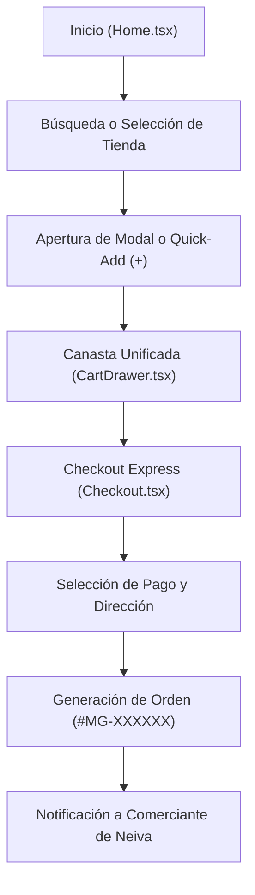

# 📋 Bitácora de Revisión y Auditoría del Sistema — MercaGo

**Proyecto:** MercaGo — Aplicativo Multiplataforma de Promociones y Abastecimiento Barrial  
**Programa:** Tecnología en Análisis y Desarrollo de Software (ADSO) — Ficha 3413974  
**Institución:** Servicio Nacional de Aprendizaje (SENA) — 2026  
**Documento:** Primera Revisión Integral de Procesos, Botones y Funcionalidades (v1.1)

---

## 👥 1. Distribución de Roles y Responsabilidades del Equipo

Para garantizar el cumplimiento de los requerimientos y la mejora continua del sistema, el equipo de trabajo distribuye sus responsabilidades técnicas y operativas de la siguiente manera:

### ⚙️ Área 1: Lógica y Funcionalidad de la Idea
* **Edwin Alejandro Esquivel Bahamon** — *Líder del Proyecto & Requerimientos de Negocio* (`esquivel202414@gmail.com`)
* **Jose Esneider Covaleda Hortua** — *Desarrollador Full-Stack & Arquitectura de Sistema* (`josecovaleda.fisica2024@gmail.com`)
* **Responsabilidades:**
  * Diseño, modelado y gobierno de la arquitectura Monolito Modular (**PERN Typed**).
  * Lógica de negocio en el Backend (controladores de tiendas, productos, órdenes y autenticación).
  * Persistencia, integridad relacional y resiliencia en base de datos (**Neon DB PostgreSQL / Prisma ORM**).
  * Reglas de negocio del cálculo de precios, canasta multi-tienda, validación de stock y checkout.

### 🔍 Área 2: Revisión de Botones, Procesos y Propuestas de Mejora
* **Paula Sofia Claros Nañez** — *Auditora de Procesos, Validación de Flujos & QA* (`Paulaclaros08@gmail.com`)
* **Joseph Felipe Aguirre Churta** — *Desarrollador Full-Stack, Interacción & Experiencia UX/UI* (`joseph.churta2009@gmail.com`)
* **Responsabilidades:**
  * Auditoría y prueba exhaustiva de todos los botones, enlaces, modales y controles táctiles del sistema.
  * Verificación de la ergonomía en dispositivos móviles (iPhone, Android, tabletas) y desktop.
  * Validación de los flujos de compra (inicio → búsqueda → canasta → checkout → confirmación).
  * Identificación de inconsistencias visuales, comportamientos inesperados y redacción de propuestas de mejora.

---

## 📚 2. Dónde Consultar el Contexto e Información del Sistema

Para el equipo auditor (Paula Claros y Joseph Aguirre) y cualquier revisor del proyecto, las fuentes de información y código fuente están estructuradas en las siguientes rutas:

| Documento / Código | Ruta en el Proyecto | Qué Información Contiene |
| :--- | :--- | :--- |
| **Contexto General & Guía Técnica** | [`README.md`](../README.md) | Visión del proyecto, comercios de Neiva, stack tecnológico, variables de entorno, comandos de ejecución y despliegue en Vercel. |
| **Especificación de Requisitos (SRS)** | [`Proyecto MercaGo - SRS.md`](../Proyecto%20MercaGo%20-%20SRS.md) | Documento formal SENA con los 10 módulos de requerimientos (**RF1 a RF20**), 10 requerimientos no funcionales (**RNF-01 a RNF-10**) y casos de uso con flujos alternativos. |
| **Vistas Principales del Usuario** | `apps/web/src/pages/` | Código de las páginas de la aplicación: [`Home.tsx`](../apps/web/src/pages/Home.tsx) (catálogo), [`Checkout.tsx`](../apps/web/src/pages/Checkout.tsx) (pago), [`Login.tsx`](../apps/web/src/pages/Login.tsx), [`Register.tsx`](../apps/web/src/pages/Register.tsx). |
| **Componentes e Interacciones UI** | `apps/web/src/components/` | Botones y modales del sistema: [`Header.tsx`](../apps/web/src/components/Header.tsx), [`CartDrawer.tsx`](../apps/web/src/components/CartDrawer.tsx), [`ProductModal.tsx`](../apps/web/src/components/ProductModal.tsx), [`InteractiveCart3D.tsx`](../apps/web/src/components/InteractiveCart3D.tsx). |
| **Estado Global de la Canasta** | `apps/web/src/context/` | Lógica de adición, persistencia y agrupación multi-tienda: [`CartContext.tsx`](../apps/web/src/context/CartContext.tsx), [`AuthContext.tsx`](../apps/web/src/context/AuthContext.tsx). |
| **Lógica Backend & APIs** | `packages/backend/src/` | Controladores REST, enrutamiento y validaciones: `controllers/`, `routes/`, `server.ts`. |
| **Base de Datos & Comercios** | `packages/database/prisma/` | Modelos de datos `schema.prisma` y catálogo semilla de Neiva `seed.ts`. |

---

## 🧪 3. Primera Revisión del Sistema (Revisión v1.1 — Septiembre 2026)

### 3.1 Checklist de Botones y Elementos Interactivos Evaluados

| Componente | Elemento Interactivo | Estado Actual | Observación de Comportamiento |
| :--- | :--- | :---: | :--- |
| **Header** | Barra de búsqueda (Desktop & Móvil) | ✅ Operativo | Filtrado reactivo en tiempo real sin recargar página. En móviles cuenta con fila dedicada. |
| **Header** | Botón "Canasta" con contador | ✅ Operativo | Abre el drawer lateral. Contador numérico verde esmeralda sincronizado con el total de ítems. |
| **Header** | Enlaces "Ingresar" / "Registrarme" | ✅ Operativo | Navegación instantánea mediante React Router a `/login` y `/register`. |
| **Hero 3D** | Botón "Hacer Pedido Ahora" | ✅ Operativo | Efecto hover con traslación de flecha y scroll suave (*smooth*) hacia el catálogo. |
| **Hero 3D** | Botón "Productos del Huila" | ✅ Operativo | Aplica filtro de categoría y desplaza la vista hacia la grilla de productos. |
| **Hero 3D** | Canvas 3D (Carrito interactivo) | ✅ Operativo | Rotación suave con mouse y touch; eje elevado donde las 4 ruedas y sombra son 100% visibles. Soporta `touch-pan-y` para no congelar el scroll vertical en móviles. |
| **Tiendas** | Chips de Comercios de Neiva | ✅ Operativo | Soporte de deslizamiento horizontal con *scroll-snap*. El botón "Elegir"/"Activa" filtra los productos del comercio seleccionado. |
| **Categorías**| Botones de píldora temática | ✅ Operativo | Selección visual activa en verde esmeralda (`#00B47A`); restablecimiento con filtro "Todos". |
| **Card Producto**| Clic en tarjeta de producto | ✅ Operativo | Despliega modal de detalle completo con fotos en alta definición. |
| **Card Producto**| Botón verde de adición rápida `[+]` | ✅ Operativo | Añade 1 unidad, cambia temporalmente a check de confirmación naranja y actualiza la canasta. |
| **Modal Producto**| Selector de cantidad `[-] Qty [+]` | ✅ Operativo | Incrementa y disminuye unidades validando límite de stock sin números negativos. |
| **Modal Producto**| Botón "Añadir a la Canasta" | ✅ Operativo | Calcula el total en tiempo real, añade la cantidad seleccionada y abre automáticamente el drawer. |
| **Modal Producto**| Botón "X" de cierre | ✅ Operativo | Cierra el modal; también se cierra al hacer clic en el backdrop oscurecido. |
| **Cart Drawer**| Botones `[-]` y `[+]` por artículo | ✅ Operativo | Modifican cantidades y recalculan subtotales en tiempo real. |
| **Cart Drawer**| Botón papelera (Eliminar) | ✅ Operativo | Remueve el ítem de la canasta y recalcula envío y total. |
| **Cart Drawer**| Botón "Proceder al Pago" | ✅ Operativo | Cierra el drawer y redirige a la vista `/checkout`. |
| **Checkout** | Selector de medio de pago | ✅ Operativo | Permite alternar entre Efectivo, Nequi/Daviplata y Datáfono con indicador visual activo. |
| **Checkout** | Botón "Confirmar y Enviar Pedido" | ✅ Operativo | Procesa la orden, genera identificador `#MG-XXXXXX` y despliega la pantalla de éxito. |

---

### 3.2 Matriz de Validación de Procesos y Flujos de Usuario

1. **Flujo de Exploración Barrial:**
   * El cliente visualiza tiendas tradicionales de Neiva (*Popular, Superior, Surabastos, Merkar Plus, Peter Pan*).
   * Estado: **Aprobado**.
2. **Flujo de Canasta Multi-Tienda:**
   * El sistema permite mezclar productos de diferentes tiendas y avisa oportunamente si se despachan por separado.
   * Estado: **Aprobado**.
3. **Flujo de Despacho y Checkout:**
   * Formulario conciso con campos obligatorios para entrega en comunas de Neiva.
   * Estado: **Aprobado**.

---

### 3.3 Registro de Hallazgos y Propuestas de Mejora (Aportes del Equipo)

Esta sección se mantendrá activa para que **Paula Sofia Claros Nañez** y **Joseph Felipe Aguirre Churta** documenten hallazgos y solicitudes de mejora que luego serán implementadas en la lógica por **Edwin Esquivel** y **Jose Covaleda**:

| ID | Fecha | Módulo / Componente | Descripción de la Propuesta / Mejora | Responsable de Revisión | Estado |
| :---: | :---: | :--- | :--- | :---: | :---: |
| **MEJ-01** | 22/09/2026 | Hero 3D | Elevar la posición del carrito 3D para evitar corte de ruedas en pantallas pequeñas. | Paula Claros / Joseph Aguirre | ✅ Implementado |
| **MEJ-02** | 22/09/2026 | Catálogo Móvil | Configurar grilla de 2 columnas en teléfonos para mejorar la navegación táctil. | Joseph Aguirre | ✅ Implementado |
| **MEJ-03** | 22/09/2026 | Header Móvil | Crear fila dedicada de búsqueda en celulares para evitar compresión de botones. | Paula Claros | ✅ Implementado |
| **MEJ-04** | 22/09/2026 | Checkout | Prevenir auto-zoom en inputs de iOS usando tipografía `text-base` en móviles. | Paula Claros | ✅ Implementado |
| **MEJ-05** | Pendiente | Notificaciones | Incorporar confirmación transaccional por mensaje de WhatsApp al comerciante. | Paula Claros / Joseph Aguirre | 📝 En planeación |
| **MEJ-06** | Pendiente | Pasarela de Pago | Integrar pasarela de pago digital Wompi/PSE en fase 2 del MVP. | Edwin Esquivel / Jose Covaleda | 📝 En planeación |

---

*Esta bitácora constituye el documento oficial de seguimiento y control de calidad entre el equipo de lógica y el equipo de procesos/UX de MercaGo.*
