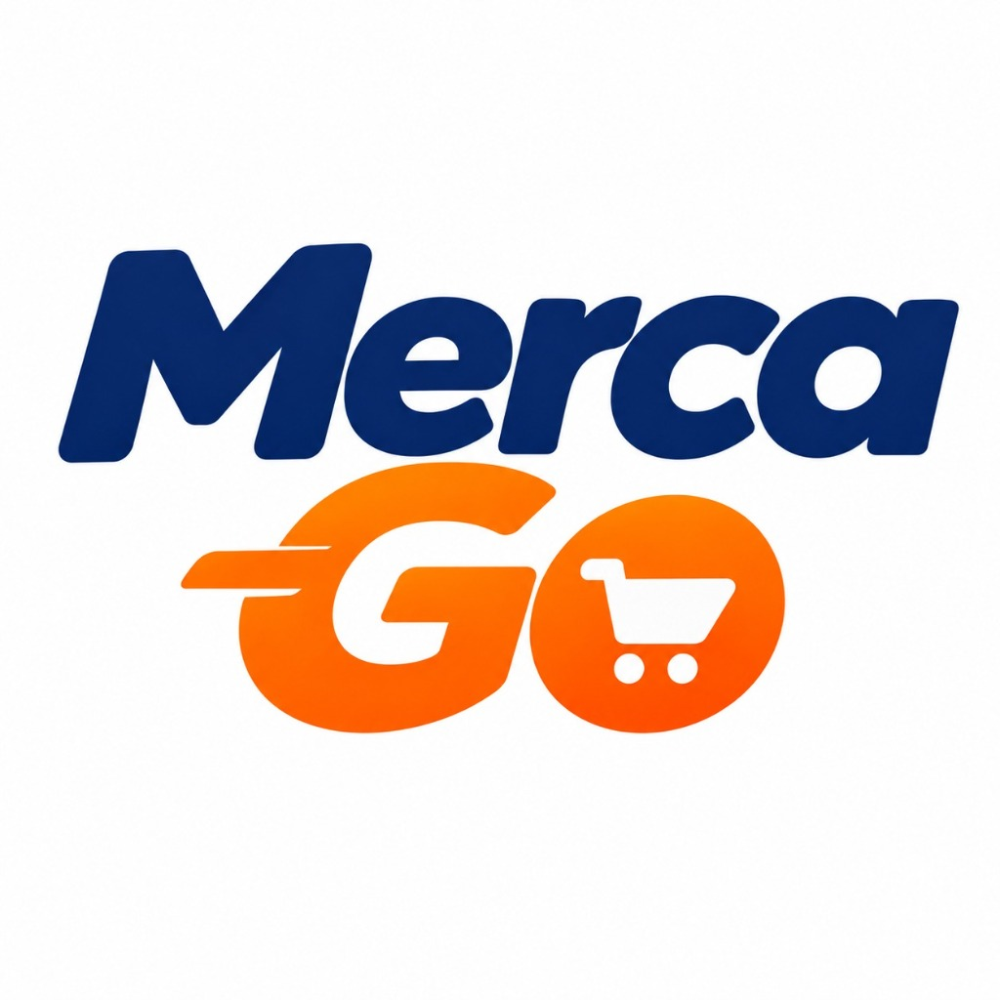

# Especificación de Requerimientos de Software (SRS) - MercaGo MVP


**Versión:** 1.0.0 (MVP)  
**Fecha:** Septiembre 2026  
**Responsable:** A03 - Product Owner & UX Integrator  
**Aprobado por:** A00 - Orquestador & Tech Lead

---

## 1. Identidad y Propósito del Negocio


### 1.1 Quiénes Somos
**MercaGo** es una plataforma hiperlocal de comercio electrónico que conecta a los consumidores de vecindarios y comunidades con las tiendas de barrio, minimercados y productores locales. Nuestra meta es democratizar el comercio digital para pequeños comerciantes y facilitar compras inmediatas, confiables y con entrega express para los hogares.

### 1.2 Misión
Transformar la economía barrial digitalizando las tiendas de conveniencia locales, brindando a los clientes una experiencia de compra veloz, transparente y accesible, al tiempo que impulsamos las ventas y la visibilidad de los pequeños comerciantes.

### 1.3 Visión
Convertirnos en la red de abastecimiento barrial líder de América Latina, conectando en tiempo real a miles de tiendas comunitarias con millones de compradores a través de soluciones tecnológicas intuitivas y accesibles.

### 1.4 Nuestros Servicios
- **Catálogo Digital de Tiendas de Barrio**: Exploración de tiendas cercanas por cercanía geográfica y categorías.
- **Inventario en Tiempo Real**: Visualización de productos frescos, abarrotes y bebidas disponibles al instante.
- **Carrito Unificado y Gestión de Pedidos**: Proceso de selección ágil con control de cantidades e importes claros.
- **Despacho y Notificaciones Express**: Coordinación directa entre el tendero y el cliente final para una entrega local inmediata o retiro programado en tienda.

---

## 2. Actores y Perfiles del Sistema

1. **Cliente Final (`CLIENTE`)**:
   - Descubre tiendas cercanas a su ubicación.
   - Explora productos por categoría y comercio.
   - Añade artículos a su carrito, revisa el total y confirma la orden.
   - Realiza seguimiento del estado de su entrega.

2. **Tendero / Comerciante (`TENDERO`)**:
   - Gestiona el perfil comercial de su tienda (nombre, descripción, dirección, teléfono, banner/logo).
   - Administra su catálogo de productos: alta, baja, modificación de precios, stock e imágenes en Cloudinary.
   - Recibe pedidos entrantes, los procesa (pendiente, en preparación, enviado, entregado) y confirma cobros.

3. **Administrador de Plataforma (`ADMIN`)**:
   - Supervisión general del ecosistema y métricas de transacciones.
   - Gestión de usuarios y habilitación de comercios afiliados.

---

## 3. Flujos Principales de Negocio

### 3.1 Flujo del Cliente
```
[Inicio / Home] ──► [Explorar Tienda & Categorías] ──► [Ver Detalle de Producto]
                           │                                     │
                           ▼                                     ▼
                    [Añadir al Carrito] ◄─────────────────────────┘
                           │
                           ▼
                 [Revisión de Carrito]
                           │
                           ▼
                  [Proceso de Checkout] ──► [Confirmación y Seguimiento]
```

1. **Descubrimiento**: El cliente ingresa a la plataforma web o móvil, visualiza banners promocionales en el carrusel de novedades y selecciona una tienda o categoría destacada.
2. **Selección de Productos**: Navega el catálogo interactivo, examina detalles, gramajes y precios, y agrega los artículos deseados a su canasta.
3. **Carrito Unificado**: Verifica la lista consolidada de productos, cantidades, subtotal e impuestos/envío calculados.
4. **Checkout & Cierre**: Ingresa la dirección de entrega, selecciona el método de pago acordado y genera su número de orden para seguimiento en vivo.

### 3.2 Flujo del Tendero
```
[Acceso Tendero] ──► [Panel de Mi Tienda] ──► [Gestión de Inventario (Fotos Cloudinary)]
                             │
                             ▼
                 [Recepción de Pedidos en Vivo]
                             │
                             ▼
         [Actualización de Estados (Preparando -> Despachado)]
```

1. **Autenticación**: Inicio de sesión seguro con perfil de comercio.
2. **Administración de Catálogo**: Carga rápida de productos con captura/subida de fotografías optimizadas en Cloudinary, fijación de precios y disponibilidad.
3. **Atención de Órdenes**: Recepción de alertas de nuevos pedidos con el detalle consolidado de artículos y datos de entrega del cliente.

---

## 4. Vistas Principales del Sistema de Diseño (UI/UX)

El diseño visual adopta una estética **Flat Design** moderna, minimalista y de alto contraste con la paleta de identidad oficial:
- **Naranja Vibrante (`#FF6B00`)**: Llamados a la acción (CTAs), carritos, botones primarios y velocidad.
- **Verde Esmeralda (`#00B47A`)**: Indicadores de frescura, estados de éxito, confirmación de pedidos y balance natural.
- **Superficies Neutras**: Blancos y grises pizarra pulidos para máxima legibilidad.

A continuación se registran los marcadores de las 4 vistas medulares para el MVP:

### Vista 1: Home con Carrusel Promocional
Página de bienvenida que presenta el carrusel dinámico con ofertas estacionales, accesos directos a categorías populares y listado de tiendas recomendadas.


### Vista 2: Detalle de Producto
Ficha enfocada en la imagen de alta resolución provista por Cloudinary, nombre, descripción comercial, precio unitario, selector numérico de unidades y botón de compra rápida.


### Vista 3: Carrito Unificado
Desglose claro e interactivo de los ítems agregados, controles para modificar cantidades, cálculo dinámico de subtotales y botón de avance al pago.


### Vista 4: Checkout
Formulario simplificado en un solo paso para validar datos del destinatario, dirección de entrega, resumen económico final y botón definitivo de confirmación de pedido.


---

## 5. Reglas de Negocio del MVP
- **RN-01**: Cada producto debe pertenecer estrictamente a una tienda registrada (`Store`).
- **RN-02**: Los pedidos registran el precio histórico de cada producto en el momento de la compra a través de la entidad `OrderItem`.
- **RN-03**: Las imágenes de productos deben alojarse en Cloudinary mediante URLs seguras generadas.
- **RN-04**: Todo usuario debe tener asignado exactamente uno de los roles autorizados (`CLIENTE`, `TENDERO`, `ADMIN`).
- **RN-05**: Ninguna orden puede confirmarse con un carrito vacío o con productos fuera de disponibilidad.
